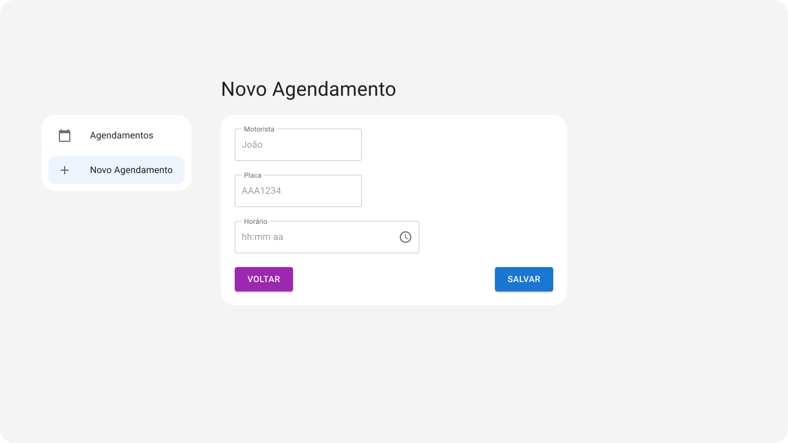
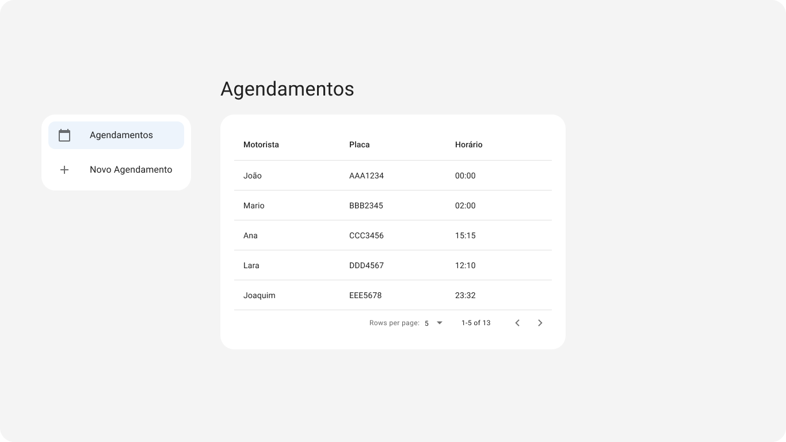

## Objetivo do Projeto

O objetivo deste projeto é implementar as páginas de agendamento de caminhões de forma que fiquem o mais próximo possível dos protótipos fornecidos. Abaixo estão os protótipos das telas esperadas:

### Protótipos

#### Novo Agendamento


#### Lista de Agendamentos


## Status Atual

Atualmente, as páginas implementadas ainda não estão completamente alinhadas com os protótipos. Algumas melhorias são bem-vindas para atingir o objetivo, além de testes unitários funcionais. Além disso, o campo "Motorista" ainda não foi implementado na página de "Novo Agendamento" e "Agendamentos". Os protótipos foram criados utilizando mui.

Os protótipos devem ser guias, mas as páginas podem ser acrescidas de detalhes (talvez, um rodapé?), campos adicionais (ex: CPF do Motorista) e funções adicionais (por exemplo, uma página de visualização, ou um `<Dialog>` para remoção de Agendamentos). 

## Como Executar

Para executar o projeto, siga os passos abaixo:

1. Instale as dependências:
   ```bash
   npm install
   ```

2. Inicie o servidor de desenvolvimento:
   ```bash
   npm run dev
   ```

3. Abra [http://localhost:3000](http://localhost:3000) no seu navegador.